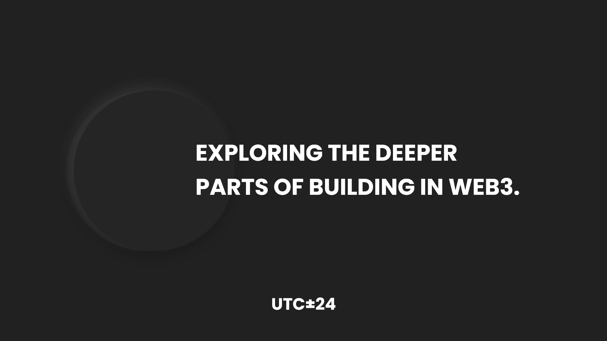

This is a [Next.js](https://nextjs.org/) project that uses hard-coded reference values for everything without the use of any API.

## Getting Started

After having configured your `.env` to include the `FONT_AWESOME_AUTH_TOKEN` run the development server:

```bash
npm run dev
# or
yarn dev
# or
pnpm dev
# or
bun dev
```

Open [http://localhost:3000](http://localhost:3000) with your browser to see the result.